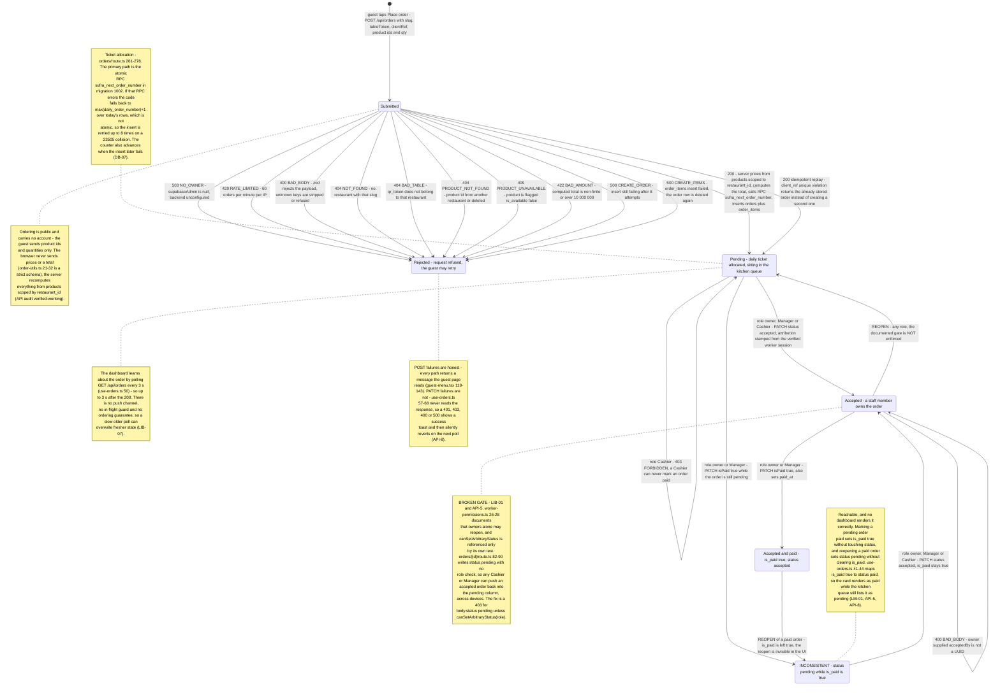

# Sufra diagrams

Three Mermaid diagrams of the system **as it is in the code**, not as `README.md`
describes it. Every node cites the file/route it came from; every place the
audits found the system broken carries its finding ID (`docs/audit/*.md`).

| File | Kind | Covers |
| --- | --- | --- |
| [`architecture.mmd`](architecture.mmd) | `flowchart` | Client surfaces, every API route by auth posture, `supabaseAdmin`, Supabase, Mistral |
| [`order-lifecycle.mmd`](order-lifecycle.mmd) | `stateDiagram-v2` | Guest submit → validate → price → ticket → persist → poll → accept → paid → reopen |
| [`scan-pipeline.mmd`](scan-pipeline.mmd) | `flowchart` | File pick → route guards → Mistral upload/OCR → quality gate → two extractors → reconcile → review → `PUT /api/menu` |

## How to render

Any of these works; the files are plain Mermaid text.

```bash
# 1. mermaid-cli (writes architecture.svg next to the input)
npx -y @mermaid-js/mermaid-cli -i docs/diagrams/architecture.mmd -o docs/diagrams/architecture.svg
npx -y @mermaid-js/mermaid-cli -i docs/diagrams/order-lifecycle.mmd -o docs/diagrams/order-lifecycle.svg
npx -y @mermaid-js/mermaid-cli -i docs/diagrams/scan-pipeline.mmd   -o docs/diagrams/scan-pipeline.svg
```

- **GitHub UI** — the fenced blocks below render in place on github.com and in
  most IDE Markdown previews (VS Code needs a Mermaid extension).
- **Any Mermaid-capable viewer** — mermaid.live, Obsidian, JetBrains Markdown,
  the Mermaid Live Editor extension. Open the `.mmd` file and paste, or point the
  viewer at the file.
- Neither `%` comments nor the `classDef` styling affect the source-of-truth
  text; they only colour the output.

All three were parsed **and** rendered with Mermaid 11 (the parser GitHub ships)
before being committed here.

---

## 1. Architecture

```mermaid
%% Sufra - runtime architecture AS BUILT (not as README.md claims).
%% Every node cites the file or endpoint that implements it; finding IDs are
%% from docs/audit/*.md. Verified: npx next build succeeds with zero env vars, 29 routes.
flowchart TB
    subgraph Clients["Client surfaces in the browser"]
        Landing["Public landing page<br/>src/app/page.tsx + src/lib/landing-i18n.tsx<br/>EN / FR / AR, no account"]
        OwnerDash["Owner dashboard and onboarding wizard<br/>src/app/(owner)/dashboard/* and src/app/onboarding/*<br/>owner account, cookie sufra_owner_session"]
        WorkerTerm["Worker terminal<br/>src/app/(worker)/worker/*<br/>cookie sufra_worker_session"]
        GuestMenu["Guest menu<br/>src/app/menu/[slug]/[token] and src/components/guest-menu.tsx<br/>NO ACCOUNT - ordering is public by design, server-priced"]
        NoDirect["BLOCKED PATH - the browser never talks to Supabase<br/>there is no anon-key client, no anon key env var, and no use-client module that imports the admin client<br/>the only importers of src/lib/supabase-admin.ts are 18 of the 20 API route files, the guest RSC,<br/>owner-auth.ts and worker-auth.ts - see owner-auth.ts:8<br/>RLS is defense-in-depth only (DB-06)"]
    end

    subgraph App["Next.js 15 app server - App Router, 29 routes, service role only"]
        subgraph Pub["Public routes - no session required"]
            A_login["POST /api/auth/login"]
            A_signup["POST /api/auth/signup"]
            A_recover["POST /api/auth/recover"]
            A_reset["POST /api/auth/reset"]
            A_callback["POST /api/auth/callback"]
            A_logout["POST /api/auth/logout"]
            A_session["GET /api/auth/session"]
            A_health["GET /api/health"]
            A_inviteget["GET /api/auth/worker/invite/[token]"]
            A_accept["POST /api/auth/worker/accept"]
            A_orderpost["POST /api/orders<br/>guest order - custom lines require a worker session"]
        end
        subgraph Own["Owner-session routes"]
            A_menuput["PUT /api/menu"]
            A_scan["POST /api/menu/scan"]
            A_password["POST /api/auth/password"]
            A_invite["POST /api/auth/worker/invite<br/>no rate limit (API-9)"]
            A_workers["GET /api/workers<br/>NO CLIENT CALLER (API-13)"]
            A_workerdel["DELETE /api/workers/[id]<br/>the only worker revocation path, unreachable (API-13)"]
        end
        subgraph Wrk["Worker-session routes"]
            A_me["GET /api/auth/worker/me"]
        end
        subgraph Both["Owner-or-worker routes"]
            A_menuget["GET /api/menu"]
            A_ordersget["GET /api/orders"]
            A_orderpatch["PATCH /api/orders/[id]"]
            A_upload["POST /api/upload"]
        end
        RSC["Guest menu RSC<br/>src/app/menu/[slug]/[token]/page.tsx<br/>server-rendered HTML, reads the database directly"]
        Admin["supabaseAdmin<br/>src/lib/supabase-admin.ts<br/>SERVICE-ROLE client - bypasses RLS<br/>null when NEXT_PUBLIC_SUPABASE_URL or SUPABASE_SERVICE_ROLE_KEY is missing"]
    end

    subgraph Supa["Supabase"]
        PG["Postgres<br/>restaurants, categories, products, restaurant_tables,<br/>orders, order_items, workers, worker_invites, sufra_daily_counters<br/>RPC sufra_next_order_number<br/>RLS enabled, bypassed by the service role"]
        GoTrue["GoTrue auth<br/>auth.users - owner email and password"]
        Store["Storage bucket menu-images - public read"]
    end

    subgraph Mistral["Mistral API"]
        MFiles["Files API<br/>POST /v1/files"]
        MOcr["OCR<br/>POST /v1/ocr with document_annotation json_schema"]
    end

    Landing -->|"POST /api/auth/login, signup, recover, reset"| A_login
    OwnerDash -->|"POST /api/auth/login - sets HttpOnly cookie sufra_owner_session, 60 days"| A_login
    OwnerDash -->|"POST /api/auth/logout - clears both cookies, no server-side revoke (LIB-03)"| A_logout
    OwnerDash -->|"PUT /api/menu - debounced 900 ms autosave"| A_menuput
    OwnerDash -->|"POST /api/menu/scan - multipart files and venue"| A_scan
    OwnerDash -->|"POST /api/upload - multipart file, 5 MB cap"| A_upload
    OwnerDash -->|"POST /api/auth/worker/invite - mint a one-time invite"| A_invite
    OwnerDash -->|"GET /api/orders - poll every 3 s"| A_ordersget
    OwnerDash -->|"PATCH /api/orders/[id] - accept, mark paid, reopen"| A_orderpatch
    WorkerTerm -->|"POST /api/auth/worker/accept - invite token, sets cookie sufra_worker_session, 7 days client-side only (LIB-02)"| A_accept
    WorkerTerm -->|"GET /api/auth/worker/me - session self-check"| A_me
    WorkerTerm -->|"GET /api/orders - poll every 3 s"| A_ordersget
    WorkerTerm -->|"PATCH /api/orders/[id] - accept, Cashier can never mark paid"| A_orderpatch
    GuestMenu -->|"POST /api/orders - slug, tableToken, clientRef, product ids and qty only"| A_orderpost
    GuestMenu -.->|"this path does not exist"| NoDirect

    A_login -->|"GoTrue signInWithPassword then GET /auth/v1/user"| Admin
    A_signup -->|"GoTrue admin createUser, then restaurants UPDATE to rebind the owner"| Admin
    A_recover -->|"GoTrue resetPasswordForEmail"| Admin
    A_reset -->|"GoTrue verifyOtp then admin updateUserById"| Admin
    A_callback -->|"GoTrue getUser on the implicit-grant token"| Admin
    A_password -->|"GoTrue admin updateUserById"| Admin
    A_session -->|"GoTrue getUser"| Admin
    A_inviteget -->|"SELECT worker_invites plus embedded restaurants"| Admin
    A_accept -->|"INSERT workers, conditional UPDATE worker_invites"| Admin
    A_orderpost -->|"SELECT restaurants, restaurant_tables, products, RPC sufra_next_order_number, INSERT orders and order_items"| Admin
    A_menuput -->|"UPDATE restaurants, UPSERT and DELETE categories, products, restaurant_tables"| Admin
    A_scan -->|"GoTrue session verify only - the scan path performs no database write"| Admin
    A_invite -->|"INSERT worker_invites"| Admin
    A_workers -->|"SELECT restaurants, workers"| Admin
    A_workerdel -->|"DELETE workers"| Admin
    A_me -->|"SELECT workers by session_token"| Admin
    A_menuget -->|"SELECT restaurants, categories, products, restaurant_tables"| Admin
    A_ordersget -->|"SELECT orders plus order_items plus restaurant_tables, limit 60"| Admin
    A_orderpatch -->|"SELECT orders and restaurants, UPDATE orders"| Admin
    A_upload -->|"Storage upload into menu-images, then getPublicUrl"| Admin
    RSC -->|"SELECT restaurants by slug, categories, products, restaurant_tables by qr_token"| Admin

    Admin ==>|"HTTPS apikey = SUPABASE_SERVICE_ROLE_KEY - server-only env var, never sent to the browser"| PG
    Admin ==>|"GoTrue admin API with the service-role key"| GoTrue
    Admin ==>|"Storage API with the service-role key"| Store
    A_scan ==>|"Authorization Bearer = MISTRAL_API_KEY - server-only env var"| MFiles
    A_scan ==>|"POST /v1/ocr with the returned file_id, model mistral-ocr-latest"| MOcr
    MFiles -.->|"file_id, passed back through the app to the OCR call"| MOcr

    classDef cred fill:#0b3a2e,stroke:#10b981,color:#ffffff
    classDef blocked fill:#4a1010,stroke:#ef4444,color:#ffffff
    classDef ghost fill:#2b2b2b,stroke:#9ca3af,color:#ffffff,stroke-dasharray:4 3
    class Admin cred
    class NoDirect blocked
    class A_workers,A_workerdel ghost
```



**What to take away**

- The browser → Supabase edge **does not exist**. There is no anon-key client,
  no `NEXT_PUBLIC_SUPABASE_ANON_KEY`, and the guest menu's HTML is rendered
  server-side by an RSC that reads the DB with the service role
  (`src/app/menu/[slug]/[token]/page.tsx:20-47`). RLS is therefore
  defense-in-depth only (**DB-06**), and the migration's policies protect an
  anon key that the app never uses.
- The only credential-carrying edges to Supabase and Mistral are the highlighted
  ones, and both secrets (`SUPABASE_SERVICE_ROLE_KEY`, `MISTRAL_API_KEY`) are
  server-side env vars read in `src/lib/supabase-admin.ts:7-15`. No `"use client"`
  module imports the admin client.
- `POST /api/orders` is the one route reachable with **no session at all** — that
  is the product, and it is safe only because pricing is recomputed server-side
  from `products` scoped by `restaurant_id` (`src/app/api/orders/route.ts:138-182`).
- Auth posture is the security boundary, so the routes are grouped by it: public,
  owner-session, worker-session, owner-or-worker. Two owner routes are marked
  ghosted because **nothing calls them** — `GET /api/workers` and
  `DELETE /api/workers/[id]`, which is also the only worker-revocation mechanism
  (**API-13**), so a lost staff device cannot be cut off.
- `POST /api/auth/worker/invite` (owner-session) has **no rate limiter**, unlike
  every sibling auth route (**API-9**) — it can mint unlimited redeemable
  credentials.
- Worker sessions are cookies with a 7-day `maxAge` and **no server-side expiry
  column**, so a captured token never ages out and logout does not invalidate it
  (**LIB-02**); the owner refresh token survives logout for up to 60 days
  (**LIB-03**).

---

## 2. Order lifecycle



**What to take away**

- The **reopen edge is broken**: `PATCH /api/orders/[id]` accepts
  `status:"pending"` from any session and never calls
  `canSetArbitraryStatus`, so a Cashier can pull an accepted order back into the
  kitchen queue. The matrix comment at `orders/[id]/route.ts:71-74` documents a
  gate the code does not implement (**LIB-01**, **API-5**).
- `status="pending"` **with `is_paid=true`** is reachable (mark a pending order
  paid; or reopen a paid one) and renders as "paid" to staff because
  `use-orders.ts:41-44` maps `is_paid` onto the client-only `status:"paid"`
  — the order is simultaneously in the pending queue and shown as paid.
- Tickets come from the **atomic RPC** `sufra_next_order_number`, with a
  non-atomic `max+1` fallback retried up to 8 times on collision; the counter
  still advances when the subsequent insert fails, so gaps are expected
  (**DB-07**). `client_ref` is a genuine idempotency key — a repeat submit
  returns the original order, not a copy.
- The dashboard sees a new order only via a **3 s poll of `GET /api/orders`**
  (`use-orders.ts:50`) — up to 3 s of kitchen latency, with no push channel and
  no in-flight guard, so a slow response can overwrite fresher state
  (**LIB-07**).
- Every PATCH failure (**401 / 403 / 400 / 500**) is invisible: `use-orders.ts`
  never reads the response, callers toast success, and the next poll silently
  reverts the card (**API-8**).

---

## 3. Scan pipeline

```mermaid
%% Sufra - AI menu scan pipeline, traced to the code, NOT to README section 6.
%% Broken stages are styled and their annotations carry finding IDs from
%% docs/audit/07-ocr-pipeline.md and docs/audit/04-lib-core.md.
flowchart TB
    subgraph ClientSide["Client - the scan dialog in the onboarding wizard"]
        Pick["Pick files<br/>menu-scan-dialog.tsx 65-85<br/>dedupe by name and size, 1 to 6 files"]
        Prep["prepareUploadFile<br/>image-utils.ts 52-79<br/>PDF or a small PNG JPEG WebP passes through unchanged,<br/>anything larger is re-encoded on a canvas"]
        Post["POST /api/menu/scan<br/>multipart files plus venue, venue capped at 200 chars,<br/>no request timeout and no cancel on dialog close"]
    end

    subgraph Guards["Route guards - the real order the code runs them"]
        G0["NO_BACKEND 503<br/>when supabaseAdmin is null"]
        G1["1. 401 UNAUTHORIZED<br/>owner session required - scan/route.ts 54-59"]
        G2["2. 429 RATE_LIMITED<br/>10 per minute per IP, Retry-After sent - 63-69"]
        G3["3. 503 NO_KEY fail-fast<br/>before any body is read - 72-77"]
        G4["4. 413 on Content-Length<br/>over 6 x 12 MB plus 4 MB - 80-86"]
        G5["5. 400 BAD_BODY then 400 TOO_MANY_FILES<br/>formData parsed first, then 1..6 files - 88-107"]
        G6["6. 413 per file over 12 MB<br/>per-file cap checked before arrayBuffer - 109-127"]
    end

    subgraph Scan["runMenuScan - src/lib/menu-scan.ts"]
        V["Validate files<br/>437-448<br/>TOO_MANY_FILES, FILE_TOO_LARGE, BAD_TYPE"]
        Up["Upload each file to Mistral Files<br/>166-180, one POST /v1/files per file, serial"]
        Ocr["OCR each document<br/>249-270, POST /v1/ocr with pages 0-19,<br/>table_format markdown, document_annotation_format json_schema"]
        Qual["assessOcrQuality on the markdown<br/>ocr-quality.ts 40-81<br/>EMPTY_TEXT, NO_ITEMS, NO_STRUCTURE, TRUNCATED"]
        Retry{"quality ok"}
        Sleep["Sleep 1.5 s times the attempt number, then re-OCR the SAME file_id<br/>306-316"]
        Fail["throw MenuScanError OCR_FAILED<br/>317-320, mapped to HTTP 502"]
        AiPath["AI path - JSON.parse the document_annotation and keep parsed.categories<br/>479-500"]
        ParserPath["Deterministic parser - parseOcrMarkdown<br/>381-424, headings become categories, priced lines become items"]
        BuildAi["buildMenuImport with stats.source set to ai"]
        BuildFb["buildMenuImport with stats.source set to fallback"]
        Rec["reconcileImports<br/>menu-import.ts 409-501, union of categories,<br/>parser price wins, AI spelling wins"]
        Empty{"any products at all"}
        EmptyThrow["throw MenuScanError EMPTY<br/>511-513, mapped to HTTP 422"]
        Ok["200 ok true with MenuImportResult<br/>route.ts 131-134"]
    end

    subgraph Review["Review and merge"]
        Dialog["Review dialog<br/>menu-scan-dialog.tsx 207-271"]
        Merge["importMenuFromScan calls mergeMenuImport<br/>onboarding-store.tsx 406-416"]
        Put["PUT /api/menu<br/>onboarding-store.tsx 226-256, 900 ms debounced autosave"]
    end

    Pick --> Prep --> Post --> G0 --> G1 --> G2 --> G3 --> G4 --> G5 --> G6 --> V --> Up --> Ocr --> Qual --> Retry
    Retry -->|"yes"| AiPath
    Retry -->|"no, attempts remain below 3"| Sleep
    Sleep --> Ocr
    Retry -->|"no, third attempt exhausted"| Fail
    AiPath --> BuildAi --> Rec
    Ocr -->|"the same markdown also feeds the baseline"| ParserPath
    ParserPath --> BuildFb --> Rec
    Rec --> Empty
    Empty -->|"none"| EmptyThrow
    Empty -->|"at least one"| Ok --> Dialog --> Merge --> Put

    N_timeout["OCR-06 no timeout<br/>there is exactly one fetch in the pipeline<br/>and no AbortSignal or AbortController anywhere in src,<br/>so a stalled provider has no bound and maxDuration 120<br/>is smaller than the sleep budget of one 6-file scan"]
    N_memory["OCR-07 memory<br/>the whole multipart body is parsed into memory before any<br/>per-file check, the Content-Length guard is skipped for a<br/>chunked client, and every file is copied again, so peak<br/>memory is roughly 3x the 76 MB upload cap"]
    N_tables["OCR-04 tables lost<br/>table_format markdown returns tables separately in page.tables<br/>while the page markdown holds only a placeholder,<br/>so a table-laid-out menu is emptied or imported as garbage"]
    N_annot["OCR-15 annotation type<br/>document_annotation is typed string and JSON.parsed unconditionally,<br/>while Mistral documents the field as a dict"]
    N_files["OCR-08 files retained<br/>uploaded Mistral file_ids are never deleted,<br/>no DELETE /v1/files exists in src"]
    N_gate["OCR-05 gate contradicts the parser<br/>items 3 or more with zero headings is rejected as NO_STRUCTURE,<br/>which is exactly the headingless menu the deterministic parser<br/>was written to rescue, so 3 paid OCR calls are burned and the<br/>whole scan fails with OCR_FAILED"]
    N_price["OCR-02 price corruption<br/>PRICE_SPLIT_RE matches the last digit run, so<br/>Couscous 1 200 is read as name Couscous 1 and price 200"]
    N_curr["OCR-03 currency and digits<br/>only DT TND the Arabic dinar mark EUR USD and E are stripped,<br/>and the digit class is ASCII only, so a bare dollar sign or<br/>Arabic-Indic digits produce price 0"]
    N_orphan["OCR-12 orphaned items<br/>items pushed before the first heading are discarded,<br/>and the recovery branch only fires when there is no heading at all"]
    N_trunc["OCR-13 truncation<br/>TRUNCATED only fires when the last non-noise line is a heading,<br/>so a fragment ending on an item line passes the gate"]
    N_heic["OCR-11 and LIB-11 upload prep<br/>HEIC and HEIF are offered by the picker but excluded from<br/>PASSTHROUGH_MIME, so iPhone photos fail the canvas decode and<br/>surface as a generic error, and a large PNG passes through<br/>byte for byte, defeating the size cap"]
    N_rec["OCR-01 reconciler<br/>reconcileImports can return fewer products than the parser<br/>produced, contradicting the invariant stated at menu-import.ts 388-390"]
    N_review["OCR-10 review truncation<br/>the dialog lists at most 8 items per category while printing the<br/>true totals, and Apply imports everything"]
    N_merge["OCR-09 silent merge skip<br/>a name collision inside an existing category hits continue,<br/>so the scanned price and description are discarded"]
    N_put["API-2 and DB-16 destructive sync<br/>PUT /api/menu deletes every category, product and table missing<br/>from the payload and never reads the delete result, while<br/>GET /api/menu turns a query error into an empty collection that<br/>the client then autosaves back"]

    Post -.-> N_timeout
    G5 -.-> N_memory
    Ocr -.-> N_tables
    Ocr -.-> N_annot
    Up -.-> N_files
    Qual -.-> N_gate
    Qual -.-> N_trunc
    ParserPath -.-> N_price
    ParserPath -.-> N_curr
    ParserPath -.-> N_orphan
    Prep -.-> N_heic
    Rec -.-> N_rec
    Dialog -.-> N_review
    Merge -.-> N_merge
    Put -.-> N_put

    classDef broken fill:#4a1010,stroke:#ef4444,color:#ffffff
    classDef warn fill:#3f2d0a,stroke:#f59e0b,color:#ffffff
    classDef note fill:#1f2937,stroke:#6b7280,color:#e5e7eb,stroke-dasharray:4 3
    class Prep,Up,Ocr,Qual,ParserPath,Rec,Post,Dialog,Merge,Put broken
    class G5,AiPath warn
    class N_timeout,N_memory,N_tables,N_annot,N_files,N_gate,N_price,N_curr,N_orphan,N_trunc,N_heic,N_rec,N_review,N_merge,N_put note
```



**What to take away**

- The quality gate **rejects exactly the menus the deterministic parser was
  written to rescue**: `items >= 3 && headings === 0` is `NO_STRUCTURE`, so a
  headingless price list burns three paid OCR calls and the scan dies with
  `OCR_FAILED` even though `parseOcrMarkdown` could have read it (**OCR-05**,
  `ocr-quality.ts:70-75`). `README.md` §6's claim that "arbitrary real menus
  pass" is false for this shape.
- Both extraction paths really do run, but the parser that is supposed to be the
  baseline **corrupts prices on real printed formats** — `Couscous 1 200` becomes
  name `Couscous 1`, price `200` (**OCR-02**), and `$12.50` or Arabic-Indic
  digits become price `0` (**OCR-03**). A wrong-but-plausible price reaches a
  live menu through `PUT /api/menu`.
- `reconcileImports` can return **fewer** products than the parser produced,
  contradicting the invariant its own comment states (**OCR-01**), and the merge
  into the onboarding store silently skips name collisions, discarding the
  scanned price (**OCR-09**).
- There is **no timeout anywhere** — one `fetch`, zero `AbortSignal`/`AbortController`
  in `src/`, and `maxDuration = 120` is smaller than the sleep budget of a single
  6-file scan, so a degraded provider ends in a platform timeout with no typed
  error and no partial result (**OCR-06**).
- The route guard order is correct and deliberate — auth → rate limit → `NO_KEY`
  fail-fast → Content-Length → `formData` → per-file cap — but the body is parsed
  into memory **before** any per-file check and the Content-Length guard is
  skipped for a chunked client, so peak memory is roughly 3× the 76 MB cap
  (**OCR-07**).
- Table-formatted menus are a silent data loss: `table_format: "markdown"`
  returns tables separately in `page.tables` while the page markdown holds only a
  placeholder (**OCR-04**), and the review dialog shows at most 8 items per
  category while Apply imports everything (**OCR-10**).

---

## Provenance

Diagrams were written from source reads of the routes and libs listed above plus
the findings in `docs/audit/01-database.md`, `02-api-routes.md`,
`04-lib-core.md` and `07-ocr-pipeline.md`. Where a prior report at the repo root
contradicts these diagrams, the code and the new audits win — notably
`SECURITY-REPORT-ROUND-2.md` (worker invite has **no** rate limiter, `API-9`;
and `POST /api/orders` still returns 429 without `Retry-After`,
`src/app/api/orders/route.ts:193-202`) and `FINAL-AGENT2-AUDIT.md` (`canSetArbitraryStatus` is
**not** harmless — the reopen gate is unenforced, `LIB-01`).
